# CyberSafe RP2040 — как мы получили доступ к защищённому USB-накопителю

> Учебное исследование собственного оборудования и собственных копий прошивки.  
> Цель работы — показать несколько **разных по механике** векторов атаки на USB-токен CyberSafe и зафиксировать их так, чтобы результат можно было воспроизвести.

## Что за устройство

CyberSafe построен на RP2040. Пользователь выбирает цифру **вращением энкодера**, а подтверждает её **нажатием на ручку энкодера**. После четырёх подтверждённых цифр устройство проверяет PIN. При успехе появляется USB Mass Storage с защищёнными файлами.

По ходу исследования мы восстановили основные параметры:

| Параметр | Значение |
|---|---|
| MCU | RP2040, ARM Cortex-M0+ |
| Прошивка | `usb_token v0.1` |
| Pico SDK | `2.2.0` |
| Flash | 2 MiB |
| Исполняемая область | `0x10000000–0x100067EF` |
| Размер программы | `0x67F0 = 26608` байт |
| SRAM | `0x20000000–0x20042000` |
| Виртуальный диск в XIP | `0x10100000` |
| Размер виртуального диска | `0x100000 = 1 MiB` |
| Файловая система после восстановления | FAT12 |

## Карта исследования

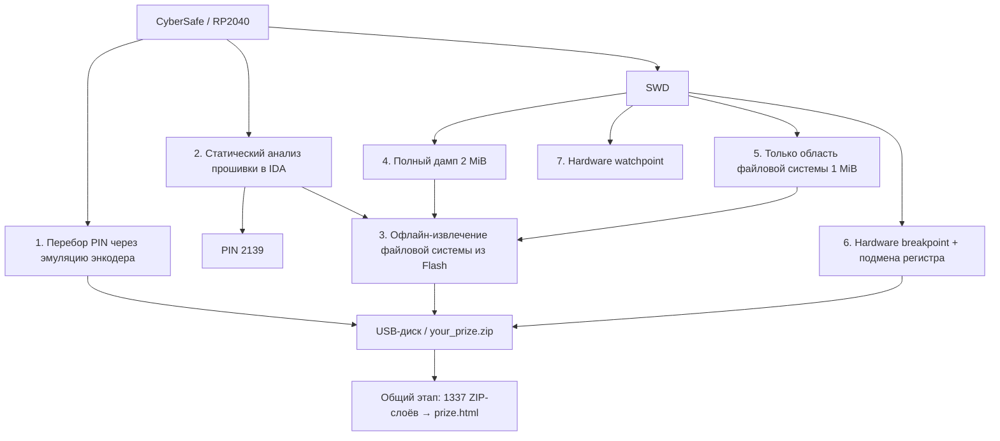

## Векторы атаки

| № | Вектор | Класс | Сложность | Статус |
|---:|---|---|---|---|
| 1 | Автоматический перебор PIN через эмуляцию энкодера | аппаратно-программный / brute force | низкая–средняя | ✅ подтверждено |
| 2 | Поиск PIN статическим анализом прошивки | программный / reverse engineering | средняя | ✅ подтверждено |
| 3 | Извлечение виртуального диска из Flash без ввода PIN | программный / data-at-rest | средняя | ✅ подтверждено |
| 4 | Полный 2 MiB XIP-дамп через SWD | аппаратный / debug interface | средняя | ✅ подтверждено |
| 5 | Чтение **только** 1 MiB области виртуального диска через SWD | аппаратный / targeted read | низкая после нахождения адреса | 🧪 воспроизводимо, нужен отдельный лог |
| 6 | Обход PIN через hardware breakpoint и подмену регистра | аппаратно-программный / dynamic analysis | средняя | ✅ подтверждено |
| 7 | Поиск логики через hardware watchpoint | аппаратно-программный / blind dynamic analysis | средняя | 🧪 метод подготовлен, эксперимент нужно повторить |

---

<a id="zip-stage"></a>

# Общий этап после получения доступа: что было в `your_prize.zip`

Этот этап одинаковый для нескольких векторов атаки, поэтому дальше я не буду повторять его в каждом разделе.

После того как мы любым способом получали доступ к содержимому виртуального накопителя, в корне находился файл:

```text
your_prize.zip
```

Его размер был **691868 байт**. Внутри находились:

```text
layers.zip
readme.txt
```

В `readme.txt` было объяснено, что нужно открыть **1337 вложенных ZIP-слоёв**. Пароль каждого слоя совпадал с его номером:

```text
layer_1.zip    → пароль 1
layer_2.zip    → пароль 2
...
layer_1337.zip → пароль 1337
```

Открывать это вручную бессмысленно, поэтому последовательную распаковку мы автоматизировали. В репозитории для воспроизведения лежит:

```text
tools/unpack_layers.py
```

Запуск:

```bash
python tools/unpack_layers.py layers.zip
```

После 1337-го слоя получался:

```text
prize.html
```

Внутри страницы:

```html
<title>Rickrolled!</title>
<h1>Ты открыл 1337 слоёв!</h1>
```

и встроенный GIF с Rick Astley — то есть финалом задания оказался рикролл.

> Все дальнейшие разделы, в которых получается `your_prize.zip` или образ диска, заканчиваются одним и тем же этапом: [распаковкой 1337 ZIP-слоёв](#zip-stage).

---

# 1. Перебор PIN через эмуляцию энкодера

## Идея

Первый вектор мы попробовали ещё без реверса прошивки. Я взял отдельную Raspberry Pi Pico и использовал её как генератор тех же цифровых сигналов, которые выдаёт механический энкодер.

То есть вместо человека, который:

1. вращает ручку энкодера;
2. выбирает цифру;
3. нажимает на ручку;

эти действия начинает выполнять другой микроконтроллер.

Так можно автоматически вводить:

```text
0000
0001
0002
...
9999
```

и перебрать всё пространство четырёхзначного PIN.

## Как я разобрался с сигналами энкодера

Сначала я экспериментально посмотрел, какие переходы нужны для вращения в одну и другую сторону, и подобрал задержку, при которой CyberSafe стабильно воспринимал импульсы.

[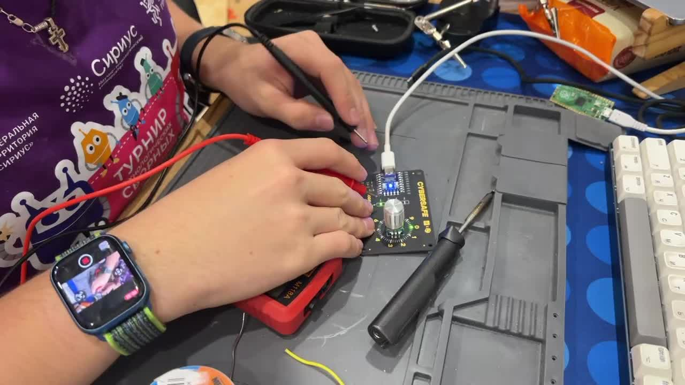](media/bruteforce/encoder_emulation_explanation.mp4)

**Видео:** [объяснение эмуляции энкодера](media/bruteforce/encoder_emulation_explanation.mp4)

Отдельно есть таймлапс пайки и подключения:

[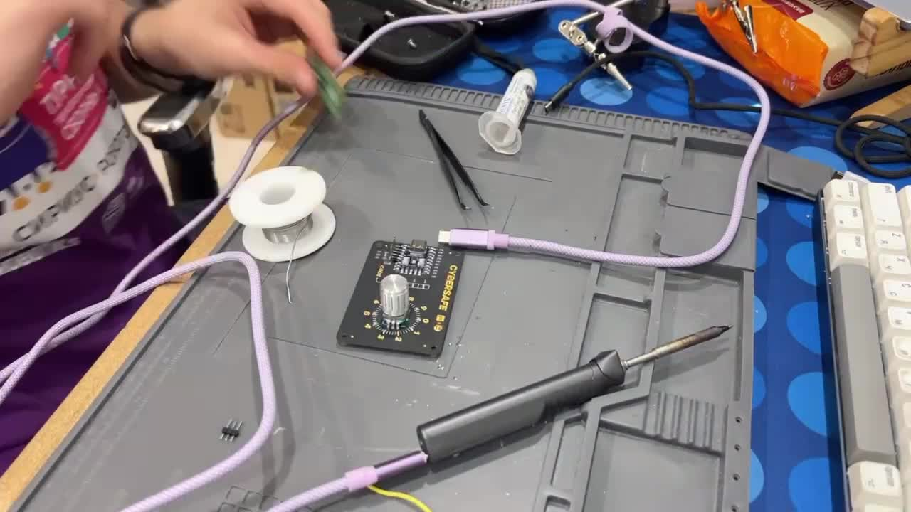](media/bruteforce/contact_soldering_timelapse.mp4)

**Видео:** [пайка контактов](media/bruteforce/contact_soldering_timelapse.mp4)

## Функция ввода одной цифры

После экспериментов с задержками получилась функция, которая поворачивает виртуальный энкодер до нужной цифры оптимальным направлением, а затем имитирует нажатие кнопки:

```python
def number(num):
    delay = 27500

    if num <= 5:
        for i in range(0, num):
            second_pin.off()
            sleep_us(delay)

            fisrt_pin.off()
            second_pin.on()
            sleep_us(delay)

            fisrt_pin.on()
            second_pin.on()
            sleep_us(delay)

    else:
        for i in range(0, 10 - num):
            fisrt_pin.off()
            sleep_us(delay)

            second_pin.off()
            fisrt_pin.on()
            sleep_us(delay)

            fisrt_pin.on()
            second_pin.on()
            sleep_us(delay)

    btn.off()
    sleep_us(delay)
    btn.on()
    sleep_us(delay * 50)
```

Полный реально использованный скрипт лежит в:

```text
code/hack.py
```

Перебор построен обычными четырьмя вложенными циклами:

```python
for a in range(10):
    for b in range(10):
        for c in range(10):
            for d in range(10):
                number(a)
                number(b)
                number(c)
                number(d)
                print(f"{a}{b}{c}{d}")
                sleep(3)
```

## Главная проблема — задержка после неправильного PIN

После каждой неудачной комбинации CyberSafe примерно на **3 секунды** блокировал новый ввод.

Только эта обязательная пауза даёт нижнюю оценку худшего случая:

```text
3 с × 10 000 = 30 000 с ≈ 8 ч 20 мин
```

Реальное время получается больше, потому что к этим 3 секундам добавляется время формирования импульсов и подтверждения четырёх цифр.

Я оставил перебор работать на ночь. К утру PIN был найден и устройство перешло в состояние успешной авторизации.

[](media/bruteforce/password_bruteforce_timelapse.mp4)

**Видео:** [таймлапс перебора PIN](media/bruteforce/password_bruteforce_timelapse.mp4)

Финальный кадр таймлапса:

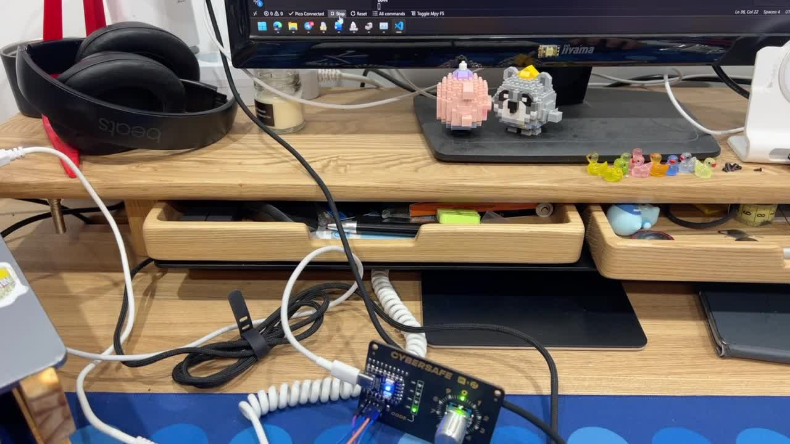

После появления USB-диска дальнейшие действия были общими: [разбор `your_prize.zip`](#zip-stage).

### Почему это уязвимость

Устройство допускает неограниченное число попыток. Трёхсекундная задержка замедляет атаку, но не делает полный перебор четырёхзначного пространства невозможным.

**Класс:** аппаратно-программный brute force.  
**Сложность:** низкая–средняя.  
**Результат:** PIN можно подобрать автоматически без анализа прошивки.

---

# 2. Статический анализ прошивки и получение PIN

После перебора мы уже знали рабочий результат, но следующим шагом было понять, можно ли получить PIN напрямую из прошивки.

## Получение и загрузка бинарника

Для анализа использовался `backup_prog.bin` размером:

```text
0x67F0 = 26608 bytes
```

IDA загружала бинарный файл как ARM little-endian по адресу:

```text
0x10000000
```

После восстановления точки входа были определены:

```text
Initial SP      = 0x20042000
Reset_Handler   = 0x100001F6
main            = 0x1000089C
```

В пользовательской логике была найдена большая функция обработки ввода:

```text
password_input_loop = 0x10000ABA
```

На скриншоте ниже видна её блочная диаграмма:

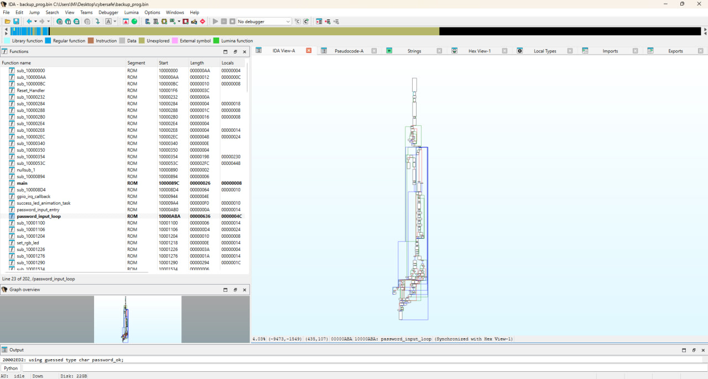

Также есть полный таймлапс работы в IDA:

[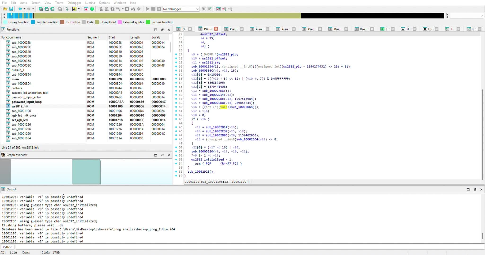](media/ida/ida_analysis_timelapse.mp4)

**Видео:** [таймлапс анализа прошивки в IDA](media/ida/ida_analysis_timelapse.mp4)

## Как именно был найден адрес PIN

Адрес `0x10005500` не угадывался и не искался простым просмотром всего дампа.

В декомпилированной `password_input_loop` была найдена проверка введённых цифр. IDA показывала сравнение вида:

```c
entered_code[v10 - 1] == *(_BYTE *)(v10 + 268457215)
```

Переводим константу:

```text
268457215 = 0x100054FF
```

Счётчик `v10` в этой проверке принимает значения от 1 до 4. Значит, правая часть последовательно читает:

```text
0x100054FF + 1 = 0x10005500
0x100054FF + 2 = 0x10005501
0x100054FF + 3 = 0x10005502
0x100054FF + 4 = 0x10005503
```

То есть сама логика проверки привела нас к четырём байтам эталонного PIN.

Переход в Hex View показал:

```text
0x10005500: 02 01 03 09
```

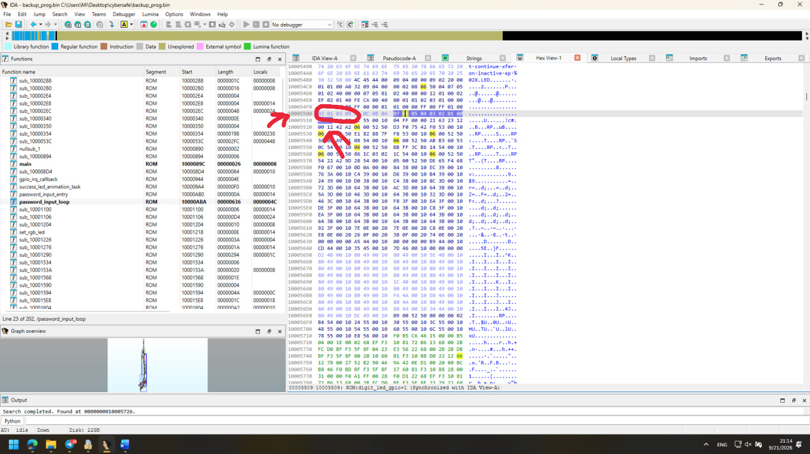

Следовательно:

```text
PIN = 2 1 3 9
PIN = 2139
```

Это важный момент: **сначала мы нашли сравнение, затем из операнда сравнения получили адрес массива, и только потом прочитали сами четыре байта.**

### Почему это уязвимость

Секрет хранится рядом с исполняемым кодом как обычный массив байтов. Любой, кто получает образ прошивки и находит функцию проверки, получает и эталонный PIN.

**Класс:** программная / hardcoded secret / reverse engineering.  
**Сложность:** средняя.  
**Результат:** PIN `2139` получен без перебора.

После этого можно штатно открыть USB-диск и перейти к [общему этапу с `your_prize.zip`](#zip-stage).

---

# 3. Извлечение виртуального диска из Flash без ввода PIN

Этот способ отличается от предыдущего: здесь PIN вообще не нужен.

## Что обнаружилось в MSC callback

При анализе TinyUSB Mass Storage callback-функций стало понятно, что содержимое виртуального диска хранится во внешней Flash.

Были восстановлены параметры:

```text
XIP address       = 0x10100000
Flash offset      = 0x00100000
Disk size         = 0x00100000
Sector size       = 512 bytes
Sector count      = 2048
```

То есть во втором мегабайте 2 MiB Flash лежит backing storage виртуального накопителя.

## Почему простой `dd` второго мегабайта ещё не даёт FAT12

Сектора во Flash проходят XOR-преобразование перед выдачей по USB. В коде были восстановлены константы:

```text
DELTA       = 0x9E3779B1
SECTOR_STEP = 0x38C9CDA0
SEED0       = 0x9E37A9EA
BLOCK_STEP  = 0x41C64E6D
```

Для воспроизведения мы вынесли декодирование в:

```text
tools/decrypt_rp2040_disk.py
```

Запуск:

```bash
python tools/decrypt_rp2040_disk.py backup.bin decrypted_flash_disk.img
```

На выходе получается 1 MiB FAT12-образ:

```text
decrypted_flash_disk.img
```

Из него извлекается:

```text
your_prize.zip
```

и дальше используется уже [общий этап с 1337 ZIP-слоями](#zip-stage).

### Почему это отдельный вектор

В предыдущем способе мы узнаём PIN и затем пользуемся штатной USB-логикой. Здесь мы вообще не проходим проверку PIN: данные извлекаются офлайн непосредственно из Flash.

**Класс:** программная / data-at-rest / reverse engineering.  
**Сложность:** средняя.  
**Результат:** содержимое накопителя восстанавливается без авторизации на устройстве.

---

# 4. Полный дамп Flash через SWD

Теперь переходим к аппаратной части.

## 4.1. Физический доступ к SWD

Фраза «SWD был доступен» здесь не совсем точна. На готовом устройстве нет удобного разъёма, в который можно просто вставить кабель.

У самого RP2040 в корпусе QFN-56 отладочный интерфейс выведен на отдельные ножки микроконтроллера:

```text
ножка 24 — SWCLK
ножка 25 — SWDIO
```

Для связи также нужна общая земля `GND`.

На готовом CyberSafe удобного SWD-разъёма для подключения отладчика нет, поэтому практический вариант физического доступа — **подпаяться непосредственно к ножкам 24 и 25 RP2040** и вывести `SWCLK`/`SWDIO` наружу.

Чтобы не рисковать выданной на хакатоне платой CyberSafe, эту гипотезу мы проверяли **не на выданной плате**, а на отдельной плате **RP2040-Zero с тем же микроконтроллером RP2040**. На ней мы физически подпаялись к ножкам QFN-56 и подтвердили, что такое подключение выполнимо. После этого тот же принцип можно перенести на исследуемое устройство.

Крупный план:

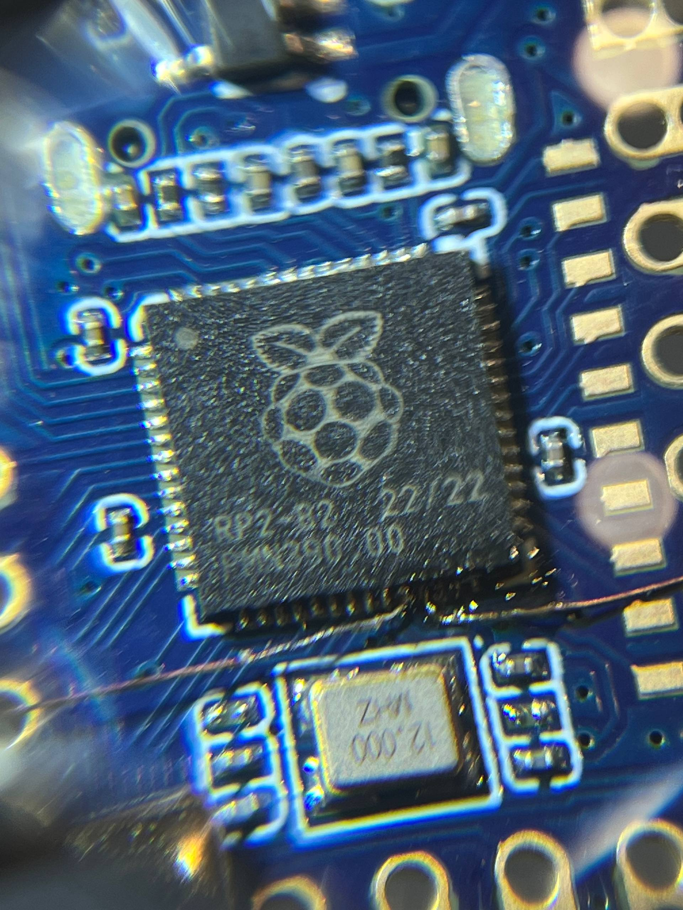

Масштаб работы:

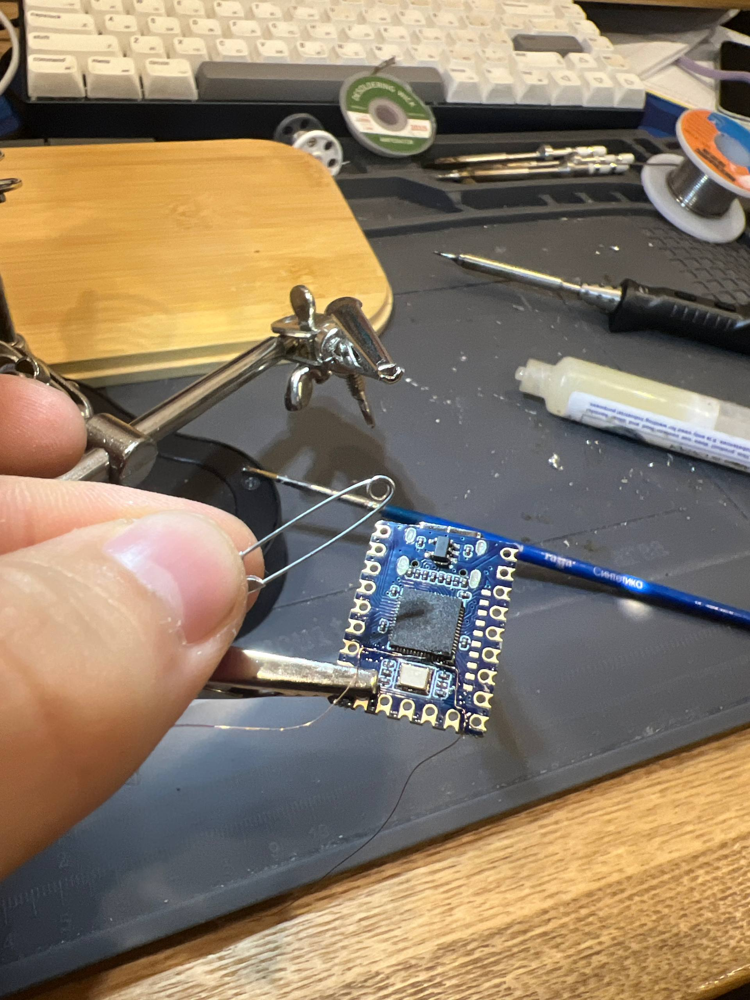

После этого Debug Probe подключается к `SWCLK`, `SWDIO` и общей земле.

## 4.2. Подключение OpenOCD

Для RP2040 использовался CMSIS-DAP / Debug Probe и OpenOCD.

Из-за двух ядер рабочая последовательность включала отключение SMP и выбор core0:

```text
cortex_m smp off
targets rp2040.core0
halt
```

OpenOCD при подключении видел оба Cortex-M0+ и аппаратные ресурсы:

```text
4 hardware breakpoints
2 hardware watchpoints
```

## 4.3. Проверка на маленьком диапазоне

Сначала был снят тестовый кусок:

```text
xip_test.bin = 4096 bytes
```

Затем только исполняемая область:

```text
swd_dump.bin = 26608 bytes
```

`SHA-256` `swd_dump.bin` совпал с `backup_prog.bin`, то есть чтение через SWD дало именно тот же код:

```text
1713db3fe890afe02303fd5bafc6d7d1a389b6d0c5786262119bb4d5a11815e4
```

## 4.4. Полный XIP-дамп

После проверки был прочитан весь диапазон 2 MiB:

```text
0x10000000 ... 0x101FFFFF
```

Пример команды:

```powershell
.\openocd.exe -s .\scripts `
  -f interface/cmsis-dap.cfg `
  -f target/rp2040.cfg `
  -c "adapter speed 500; init; cortex_m smp off; targets rp2040.core0; halt; wait_halt 5000; dump_image rp2040_xip_full.bin 0x10000000 0x200000; shutdown"
```

Файл:

```text
rp2040_xip_full.bin = 2097152 bytes
```

Первые `26608` байт этого дампа побайтно совпадают с `backup_prog.bin`.

После этого полный дамп можно обработать способом из [вектора №3](#3-извлечение-виртуального-диска-из-flash-без-ввода-pin), а затем перейти к [общему этапу ZIP](#zip-stage).

**Класс:** аппаратная / открытый debug interface при физическом доступе.  
**Сложность:** средняя из-за пайки, низкая после появления стабильного SWD-соединения.  
**Результат:** полный 2 MiB образ Flash без знания PIN.

---

# 5. Через SWD можно снять только файловую систему

Это отдельный вектор, потому что для кражи файлов не обязательно копировать всю Flash и не обязательно анализировать код.

После предыдущего анализа мы уже знаем, что backing storage диска расположен по XIP-адресу:

```text
0x10100000
```

и занимает:

```text
0x100000 = 1 MiB
```

Поэтому через SWD можно целенаправленно прочитать только этот диапазон:

```powershell
dump_image vfs_raw.bin 0x10100000 0x100000
```

После этого `vfs_raw.bin` декодируется тем же алгоритмом, что и в [векторе №3](#3-извлечение-виртуального-диска-из-flash-без-ввода-pin).

### Чем этот способ отличается от полного SWD-дампа

Полный дамп:

```text
2 MiB: программа + данные + виртуальный диск
```

Целевое чтение:

```text
1 MiB: только backing storage виртуального диска
```

Здесь атакующему вообще не нужен первый мегабайт Flash.

> Для этого способа у нас есть подтверждённый адрес и подтверждённая возможность чтения XIP через SWD, но в текущем архиве материалов нет отдельного скриншота именно команды `dump_image ... 0x10100000 0x100000`. Его стоит добавить как отдельное доказательство этого вектора.

**Класс:** аппаратная / targeted memory extraction.  
**Сложность:** низкая после определения диапазона.  
**Результат:** можно извлечь только данные накопителя, не снимая полный образ.

---

# 6. Обход проверки PIN через hardware breakpoint

Это самый наглядный SWD-вектор: мы уже не копируем память, а вмешиваемся прямо в исполнение программы.

## 6.1. Как при SWD-отладке нашли место ввода и проверки PIN

Здесь важно разделить две вещи:

- IDA заранее показала нам область `password_input_loop`, поэтому мы знали, **в какой функции примерно искать**;
- конкретное место, которое действительно исполняется при вводе и проверке цифры, мы уже подтверждали **динамически через SWD и аппаратные breakpoint'ы**.

То есть адрес `0x10000C8A` не был выбран «на глаз» и сразу использован для подмены.

### Шаг 1. Проверяем, что попали в обработку введённой цифры

Сначала breakpoint ставился на участок внутри `password_input_loop`:

```text
0x10000C5A
```

После:

```text
bp 0x10000C5A 2 hw
resume
```

мы вращали энкодер, выбирали цифру и **нажимали на его ручку**, подтверждая ввод. CPU останавливался в этой области, поэтому стало понятно, что мы действительно находимся на живом пути обработки введённой цифры.

### Шаг 2. Переносим breakpoint ближе к сравнению

Дальше breakpoint был перенесён на:

```text
0x10000C86
```

В этом месте начинается короткая последовательность загрузки двух сравниваемых байтов:

```asm
0x10000C86: LDRB R2, [R3, R4]
0x10000C88: LDRB R3, [R5, R4]
0x10000C8A: CMP  R2, R3
```

На `0x10000C86` мы уже могли выполнять инструкции пошагово через `step` и смотреть, как меняются регистры.

После первой `LDRB` в `R2` оказывалась введённая цифра.  
После второй `LDRB` в `R3` оказывалась ожидаемая цифра PIN.  
`R4` менялся вместе с позицией проверяемой цифры.

Следующая инструкция:

```asm
CMP R2, R3
```

и была непосредственной проверкой:

```text
введённая цифра == ожидаемая цифра
```

Так динамическая отладка сузила путь:

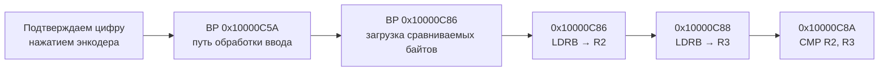

### Шаг 3. Ставим breakpoint непосредственно перед сравнением

После этого для самой атаки использовался уже точечный breakpoint:

```text
bp 0x10000C8A 2 hw
resume
```

После подтверждения очередной цифры CPU останавливался непосредственно перед `CMP`:

```text
PC = 0x10000C8A
```

В момент остановки:

```text
R2 — введённая цифра
R3 — ожидаемая цифра PIN
R4 — текущая позиция проверки
```

Это уже не просто вывод из IDA: значения регистров и остановка на `PC = 0x10000C8A` были проверены на работающем устройстве через SWD.

На фотографии ниже в OpenOCD видны остановки на breakpoint, чтение и изменение регистров, пошаговое выполнение, а в Проводнике уже открыт `USB Drive (G:)` с `your_prize.zip`:

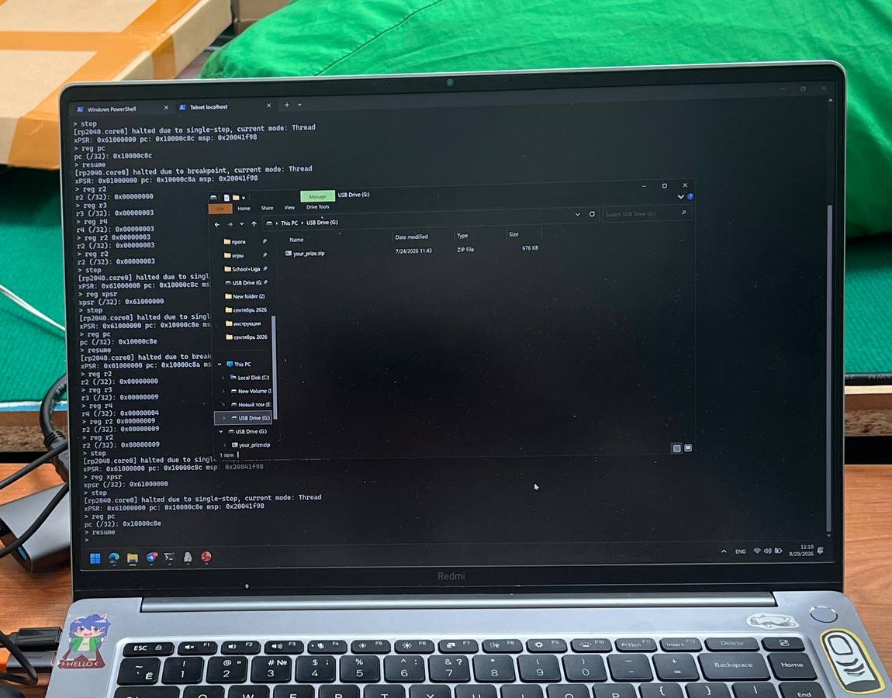

Исходная фотография всей установки:

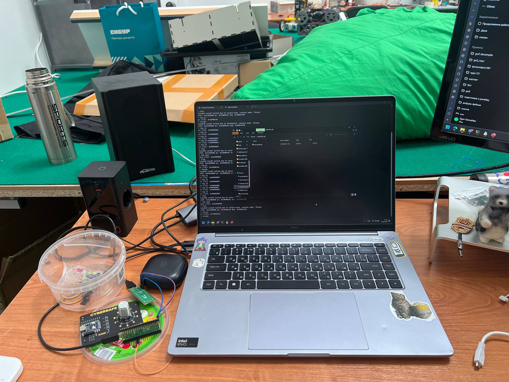

## 6.2. Подмена результата сравнения

Чтобы любая введённая цифра прошла проверку, перед `CMP` мы делали:

```text
reg r2 <значение R3>
```

Например, если:

```text
R2 = 0
R3 = 9
```

то перед сравнением:

```text
reg r2 0x9
```

После этого:

```text
step
resume
```

Для четырёхзначного PIN такой приём нужно повторить **четыре раза**.

После четвёртого успешного сравнения прошивка перешла по ветке успеха и USB-диск появился в системе.

## 6.3. Что нас сначала запутало

Аппаратный breakpoint не сохраняется после полного снятия питания.

Во время первого повторения эксперимента плату обесточили и забыли снова выполнить:

```text
bp 0x10000C8A 2 hw
```

Поэтому казалось, что метод перестал работать. После повторной установки breakpoint и четырёх подмен `R2` диск снова открылся.

### Почему это отдельный вектор

Здесь можно вообще не знать правильные цифры PIN как пользователь. Проверка обходится за счёт изменения состояния CPU непосредственно перед `CMP`.

**Класс:** аппаратно-программная / runtime manipulation.  
**Сложность:** средняя.  
**Результат:** USB-диск открывается после четырёх подмен регистра.

Дальше — [общий этап с `your_prize.zip`](#zip-stage).

---

# 7. Hardware watchpoint

Watchpoint похож на breakpoint только внешне. По смыслу это другой инструмент:

```text
breakpoint → остановись на известной инструкции
watchpoint → остановись, когда кто-то изменит интересующий адрес памяти
```

У RP2040/OpenOCD в нашем соединении доступно два аппаратных watchpoint.

## 7.1. Вариант после анализа прошивки

Если адрес флага успеха уже известен:

```text
password_ok = 0x20002ED2
```

можно поставить:

```text
wp 0x20002ED2 1 w
resume
```

Когда прошивка попытается изменить этот байт, CPU остановится на инструкции записи.

Дальше:

```text
debug_reason
reg pc
reg
mdb 0x20002ED2 1
```

Так мы получаем реальный адрес кода, который меняет состояние авторизации.

## 7.2. Watchpoint вообще без анализа прошивки в IDA

Более интересный вариант — использовать watchpoint как способ **с нуля найти логику ввода**, не зная ни `password_input_loop`, ни `0x10000C8A`, ни `password_ok`.

### Шаг 1. Снять SRAM до действия

```text
halt
dump_image ram_before.bin 0x20000000 0x42000
resume
```

### Шаг 2. Подтвердить одну цифру

Пользователь вращает энкодер, выбирает цифру и нажимает на его ручку.

Снова останавливаем CPU:

```text
halt
dump_image ram_after.bin 0x20000000 0x42000
```

### Шаг 3. Сравнить два дампа

Ищем байты RAM, которые изменились именно после подтверждения цифры.

Эксперимент можно повторить с разными цифрами и разными позициями PIN. Кандидат на буфер ввода должен:

- меняться после нажатия;
- принимать значения `0..9`;
- изменяться предсказуемо при следующей позиции.

### Шаг 4. Поставить WP на найденный байт

```text
wp <candidate_address> 1 w
resume
```

После следующего подтверждения цифры процессор сам остановится на инструкции, которая записывает значение в этот адрес.

Теперь:

```text
debug_reason
reg pc
reg
```

даёт точный `PC` функции обработки ввода.

### Шаг 5. Дальше идти динамически

От места записи можно:

- делать `step`;
- смотреть соседние инструкции;
- поставить следующий watchpoint на данные, в которые копируется введённая цифра;
- дойти до цикла сравнения PIN уже без предварительного статического анализа.

То есть здесь SWD используется не для подтверждения IDA, а как самостоятельный инструмент reverse engineering.

> **Статус:** этот blind-watchpoint эксперимент мы ещё не довели до отдельного доказательного прогона. При эксперименте с breakpoint watchpoint не был установлен, поэтому отдельного лога `debug_reason / PC` для WP пока нет.

**Класс:** аппаратно-программная / blind dynamic analysis.  
**Сложность:** средняя.  
**Результат:** позволяет найти код ввода и проверки по факту изменения RAM, не зная заранее адресов функций.

---

# Что в итоге сломало модель защиты

Устройство оказалось уязвимо сразу на нескольких уровнях:

1. **PIN всего четырёхзначный**, а число попыток не ограничено окончательно.
2. **PIN лежит в читаемой Flash** как четыре байта.
3. **Виртуальный диск физически находится в той же Flash**, а PIN только управляет тем, будет ли он показан по USB.
4. XOR-преобразование диска полностью восстанавливается из прошивки.
5. При физическом доступе SWD позволяет читать память и вмешиваться в исполнение CPU.

Самый важный вывод: скрыть USB Mass Storage до ввода PIN — не то же самое, что криптографически защитить данные на Flash.

---

# Что ещё нужно доснять для идеальной доказательной базы

Из присланного архива уже есть:

- ✅ IDA: адрес `0x10005500` и байты `02 01 03 09`;
- ✅ IDA: граф `password_input_loop`;
- ✅ видео работы в IDA;
- ✅ видео эмуляции энкодера;
- ✅ таймлапс перебора;
- ✅ таймлапс пайки для перебора;
- ✅ фото пайки к выводам RP2040 для SWD;
- ✅ фото масштаба этой пайки;
- ✅ фото успешной BP-атаки, где одновременно видны OpenOCD и открытый `USB Drive (G:)`;
- ✅ сам `rp2040_xip_full.bin` размером 2 MiB.

Для полного закрытия всех векторов ещё желательно добавить:

1. **Фото именно после brute-force**, где в Проводнике явно виден открытый диск или `your_prize.zip`. В текущем архиве есть таймлапс и зелёное состояние платы, но отдельного такого фото нет.
2. **Скриншот команды полного SWD-дампа** с `dumped 2097152 bytes`.
3. **Отдельный прогон чтения только VFS**:
   ```text
   dump_image vfs_raw.bin 0x10100000 0x100000
   ```
   плюс размер `1048576`.
4. **Эксперимент с watchpoint** и скриншот:
   ```text
   wp ...
   debug_reason
   reg pc
   ```

После этого у каждого заявленного вектора будет своё отдельное доказательство.

---

## Исходное техническое задание

В пакет также добавлен исходный PDF задания:

```text
docs/Positive Technologies.pdf
```

По заданию требовалось для каждого найденного способа указать вектор атаки, классификацию, сложность и доказательство работоспособности. Поэтому способы через SWD в этом README намеренно разделены на полный дамп, чтение только области диска, вмешательство через breakpoint и отдельный сценарий с watchpoint.

---

# Структура приложенных материалов

```text
README.md
README_SIMPLE.md

code/
└── hack.py

tools/
├── decrypt_rp2040_disk.py
└── unpack_layers.py

assets/
├── bruteforce/
├── ida/
└── swd/

media/
├── bruteforce/
└── ida/
```

`README.md` — эта расширенная версия с Mermaid, превью видео и подробными пояснениями.  
`README_SIMPLE.md` — упрощённая версия для репозитория, если нужен максимально обычный Markdown без декоративных блоков.
